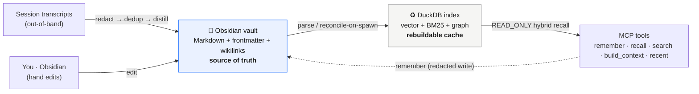

# 🪨 agentcairn

**Local-first memory for AI agents — that you can actually read, edit, and own.**

> **cairn** &nbsp;/kɛən/&nbsp; · *noun* — a stack of stones raised to mark a trail or a place worth remembering, left for whoever comes next.

agentcairn gives your coding agent durable, high-quality memory — but instead of locking it in an opaque database or a cloud service, **your memories live as plain Markdown in an [Obsidian](https://obsidian.md) vault you own.** A fast, rebuildable [DuckDB](https://duckdb.org) index sits on top for retrieval. Open your vault, read what the agent remembered, fix a wrong fact by hand, or drop in your own notes — and the agent picks it all up.

## Why agentcairn is different

Most agent-memory systems make a database or cloud store the source of truth and treat files (if any) as a one-way export. agentcairn inverts that:

- **📂 Your vault is the source of truth — not an export.** Memory is human-readable Markdown with frontmatter and `[[wikilinks]]`. Edit it in Obsidian; the index honors your edits.
- **♻️ The index is disposable.** DuckDB is a rebuildable cache (`cairn reindex`). Your memory survives a model upgrade, a corrupted index, a schema change, or uninstalling the tool — **zero data loss**, because the truth is just files on disk.
- **🧠 Non-lossy by construction.** The full note is always retained. Distillation only *adds* derived notes that link back to the source — it never silently drops facts it didn't think to extract at write time.
- **🔒 Redaction before every write.** Secrets are scrubbed (regex + entropy + URL-credential detection) before anything — body, title, or tags — reaches the plaintext vault. We write files you can read, so we treat a leaked credential as the worst failure mode.
- **🕸️ A free, deterministic knowledge graph.** Your `[[wikilinks]]` and frontmatter *are* the graph — no LLM extraction, no hallucinated entities.
- **🪶 Daemonless, zero external DB.** One embedded DuckDB file does semantic vector search, BM25 full-text, and graph traversal. No always-on server, no Neo4j/Postgres/Qdrant, no required cloud key — just a `cairn` CLI and an on-demand MCP server.
- **🔍 Honestly measured.** A reproducible LongMemEval-S + LoCoMo harness ships in [`benchmarks/`](benchmarks/) — with real numbers, ablations, and explicit caveats instead of one cherry-picked headline (see below).

## Install

The easiest way to use agentcairn is the **[Claude Code](https://claude.com/claude-code) plugin** — one install wires up the MCP server, ambient memory (recall at session start, capture at session end), a memory skill, and slash commands:

```bash
claude plugin marketplace add ccf/agentcairn
claude plugin install agentcairn@agentcairn
```

On install you pick a vault path (default `~/agentcairn`); it's **auto-created** on the first session — no Obsidian setup required. From then on agentcairn surfaces relevant memory at the start of each session, distills each session into your vault, and gives you `/agentcairn:recall`, `/remember`, `/memory`, `/savings`, and `/ingest`. Nothing to pip-install — the plugin runs the published package via `uvx`.

> Not on Claude Code? agentcairn is also a standalone MCP server + CLI for any host — see [Using it directly](#using-it-directly).

## How it works



- **Capture** reads your agent harness's session transcripts (append-only, already on disk) *out-of-band* — robust by design, with no fragile live hooks — then redacts → dedups → importance-gates → distills into the vault, non-lossily. Plus an agent-driven `remember` tool for curated, high-value memories.
- **Retrieval** fuses BM25 + semantic vectors with Reciprocal Rank Fusion, applies an optional graph-boost, and **degrades gracefully** down to keyword-only when no embedding model is available — so recall is *never* silently dead. An optional cross-encoder reranker adds precision.
- **Hybrid intelligence:** offline local embeddings (FastEmbed / `nomic-embed-text-v1.5` by default) out of the box — strong on its own *and* in the hybrid fusion (with `nomic`, vector-only edges out BM25 even on short turns; see the benchmark). Set `CAIRN_EMBED_MODEL` to pick another FastEmbed model, or run `CAIRN_EMBEDDER=ollama` / a cloud tier to go further.
- **Temporal memory:** notes may carry `valid_from`/`valid_until`/`superseded_by` frontmatter. Recall is validity-aware — it soft-demotes superseded and expired facts (the *current* fact wins) without ever hiding them (non-lossy), and annotates each result's status (`current`/`superseded`/`expired`/`not_yet_valid`) plus an `as_of` anchor so the agent can reason over time. Inert for notes with no validity fields.

## Using it directly

The plugin is the easiest path, but agentcairn is just a package — use it without Claude Code via the on-demand MCP server (for any MCP host) or the `cairn` CLI:

```bash
uvx agentcairn                                       # on-demand MCP server for any MCP host
cairn ingest --vault ~/vault                         # distill recent agent sessions into the vault
cairn sweep  --vault ~/vault                          # ingest + reindex in one pass (cron-friendly)
cairn recall "how did we fix the auth bug?"          # hybrid recall from the CLI
cairn savings                                        # how much context recall has saved you
cairn reindex ~/vault                                # rebuild the index from Markdown (always safe)
cairn doctor                                         # health-check the index
```

## Honestly measured

We benchmark agentcairn the way we'd want a memory system measured — **reproducibly, with ablations, and without a single cherry-picked headline number.** The harness ([`benchmarks/`](benchmarks/)) runs **LongMemEval-S** and **LoCoMo** through a version-pinned downloader (datasets are never vendored), scores retrieval deterministically (recall/nDCG@k, MRR — no API key needed, runs in CI on a synthetic fixture), and offers an opt-in LLM-judged QA layer.

Retrieval ablation on the full LoCoMo set (turn-level, macro-avg, FastEmbed `nomic-embed-text-v1.5` — the default):

| arm | recall@5 | recall@10 | MRR |
|---|---|---|---|
| BM25 only | 0.527 | 0.604 | 0.459 |
| vector only | 0.536 | 0.637 | 0.433 |
| hybrid (RRF) | 0.562 | 0.648 | 0.477 |
| hybrid + graph-boost | 0.562 | 0.648 | 0.477 |
| **hybrid + reranker** | **0.662** | **0.735** | **0.608** |

What we read from this — and say out loud:
- **Hybrid beats either arm alone** — RRF fusion is worth it.
- **The cross-encoder reranker is the biggest lever** (+0.10 recall@5 over hybrid); the "ms-marco domain-shift might hurt" worry didn't materialize on conversational data.
- **The embedder default now pulls its weight** — with `nomic`, vector-only *edges out* BM25 (0.536 vs 0.527); switching from the old `bge-small` default (which trailed at 0.483) closed the gap. A 5-model FastEmbed sweep settled the pick — `nomic` (768-d) wins on quality-per-dim; bigger 1024-d models don't beat it. Full table: [`benchmarks/README.md`](benchmarks/README.md).
- **graph-boost is inert on these corpora** — LoCoMo/LongMemEval have no native `[[wikilink]]` graph, so the boost has nothing to fire on. It's for *real interlinked vaults*, not chat logs, and we don't pretend otherwise.

**LongMemEval-S** (50-instance sample) is an easier retrieval task with well-separated evidence sessions. At **session level** (the granularity prior work reports) retrieval is essentially perfect — **recall@5 = 1.00** for *every* arm (hybrid+reranker nDCG@10 0.993 / MRR 0.990); at the finer **turn level**, hybrid+reranker reaches **0.96 recall@5**. Two caveats we say out loud: session-recall@5 *saturates* at 1.0 here (even BM25 hits it), so it isn't a discriminating metric on this corpus; and it's a 10% sample — comparable for relative signal, not a leaderboard claim.

**Context efficiency.** On LongMemEval-S's ~136k-token sessions, agentcairn answers from the ~2,500 tokens it *recalls* (top-10) rather than the full history — a **~55× reduction** in what the model has to read (estimate, ~4 chars/token; 20-query sample). It measures context *size*, independent of retrieval quality.

QA-accuracy numbers (LLM-judged) are available too, but use an Anthropic judge rather than the papers' GPT-4o, so they are **not comparable to published leaderboards** — valid for relative ablation signal only. See [`benchmarks/README.md`](benchmarks/README.md) for how to run it and how to read the numbers.

## Roadmap

- **v1 — done.** The core loop: transcript ingestion → redaction → Markdown → rebuildable DuckDB index → hybrid recall; MCP server + CLI; secret redaction; local embeddings; reproducible benchmark harness.
- **v1.1 — next, prioritized by the benchmark above:**
  - ✅ **Reranker on by default** — the largest measured retrieval lever; `CAIRN_RERANK=0` to disable. *(shipped)*
  - **Ollama embedding tier** — ✅ local models via `CAIRN_EMBEDDER=ollama` (`CAIRN_EMBED_MODEL`/`OLLAMA_HOST`); cloud (OpenAI/Voyage) still pending.
  - ✅ **Bi-temporal validity** — frontmatter `valid_from`/`valid_until`/`superseded_by`; recall soft-demotes superseded/expired facts (non-lossy — never hidden) and annotates each result's currency + an `as_of` anchor, so the *current* fact wins and the agent can reason over time. *(shipped)*
  - In-memory HNSW for large-vault retrieval latency.
- **v2** — Obsidian plugin surface, MotherDuck cloud sync, optional LLM entity extraction.

## Development

agentcairn uses [uv](https://docs.astral.sh/uv/) exclusively for dependency management and tooling.

**Do not use pip, poetry, or global virtual environments.**

```bash
# First-time setup
uv sync                         # create .venv and install all deps (including dev)
uv run pre-commit install       # install git hooks (ruff + pytest run on every commit)

# Daily use
uv run pytest                   # run the test suite
uv run cairn --help             # run the CLI
uvx agentcairn                  # run the installed tool ephemerally (as the MCP server does)

# Formatting and linting
uv run ruff format .            # format all Python files
uv run ruff check --fix .       # lint with auto-fix
uv run pre-commit run --all-files

# Benchmarks (offline retrieval metrics need no API key)
uv run pytest benchmarks/tests/                                      # offline synthetic-fixture suite
PYTHONPATH=benchmarks uv run --group bench python -m cairn_bench.run --dataset locomo
```

The MCP server is launched via `uvx agentcairn` — no global install required.

## License

[Apache License 2.0](LICENSE) — permissive, with an explicit patent grant. Copyright © 2026 Charles C. Figueiredo.
