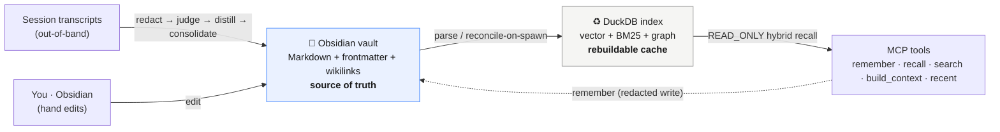

# 🪨 agentcairn

[](https://github.com/ccf/agentcairn/actions/workflows/ci.yml)
[](https://github.com/ccf/agentcairn/actions/workflows/trivy.yml)
[](https://pypi.org/project/agentcairn/)
[](https://pypi.org/project/agentcairn/)
[](https://github.com/ccf/agentcairn/blob/main/LICENSE)

**Local-first memory for AI agents — that you can actually read, edit, and own.**

> **cairn** &nbsp;/kɛən/&nbsp; · *noun* — a stack of stones raised to mark a trail or a place worth remembering, left for whoever comes next.

agentcairn gives your coding agent durable, high-quality memory — but instead of locking it in an opaque database or a cloud service, **your memories live as plain Markdown in an [Obsidian](https://obsidian.md) vault you own.** A fast, rebuildable [DuckDB](https://duckdb.org) index sits on top for retrieval. Open your vault, read what the agent remembered, fix a wrong fact by hand, or drop in your own notes — and the agent picks it all up.

## Why agentcairn is different

Most agent-memory systems make a database or cloud store the source of truth and treat files (if any) as a one-way export. agentcairn inverts that:

- **📂 Your vault is the source of truth — not an export.** Memory is human-readable Markdown with frontmatter and `[[wikilinks]]`. Edit it in Obsidian; the index honors your edits.
- **♻️ The index is disposable.** DuckDB is a rebuildable cache (`cairn reindex`). Your memory survives a model upgrade, a corrupted index, a schema change, or uninstalling the tool — **zero data loss**, because the truth is just files on disk.
- **🧠 Non-lossy by construction.** The full note is always retained. Distillation only *adds* derived notes that link back to the source — it never silently drops facts it didn't think to extract at write time.
- **🔒 Redaction before every write.** Secrets are scrubbed (regex + entropy + URL-credential detection) before anything — body, title, or tags — reaches the plaintext vault. We write files you can read, so we treat a leaked credential as the worst failure mode.
- **🕸️ A free, deterministic knowledge graph.** Your `[[wikilinks]]` and frontmatter *are* the graph — no LLM extraction, no hallucinated entities. `cairn link` writes each note's top semantic neighbors into a `related:` frontmatter list (deterministic, opt-in) so the graph lights up in Obsidian.
- **🔮 Read your memory in Obsidian.** The companion [agentcairn-obsidian](https://github.com/ccf/agentcairn-obsidian) plugin (on the Obsidian community store) adds a vault-native **Memory view**: a filterable list of notes with provenance and currency, plus a d3-force **memory graph** of `related:` links — colored by project, sized by importance, superseded notes dimmed. **0.4.0** adds a **facet-hub graph** ("group by" project / harness / tag → hub nodes) so you can see your memory's shape at a glance.
- **🤖 Works across every agent you use.** Plugins for Claude Code, Codex, and Antigravity; an MCP server + skill for Cursor and any other MCP host; and a native [Hermes](https://github.com/NousResearch/hermes-agent) `MemoryProvider` ([`integrations/hermes/`](integrations/hermes/)) — all sharing the *same* vault, so your memory follows you across agents instead of fragmenting per-tool. `cairn sweep` auto-detects and ingests Claude Code, Codex, Antigravity, and Cursor sessions; `cairn schedule install` keeps it running on a managed launchd/crontab job as a host-agnostic capture backstop.
- **🪶 Daemonless, zero external DB.** One embedded DuckDB file does semantic vector search, BM25 full-text, and graph traversal. No always-on server, no Neo4j/Postgres/Qdrant, no required cloud key — just a `cairn` CLI and an on-demand MCP server.
- **🔍 Honestly measured.** A reproducible LongMemEval-S + LoCoMo harness ships in [`benchmarks/`](benchmarks/) — with real numbers, ablations, and explicit caveats instead of one cherry-picked headline (see below).

## Install

The easiest way to use agentcairn is the **plugin** for [Claude Code](https://claude.com/claude-code) or [Codex](https://github.com/openai/codex) — one install wires up the MCP server, ambient memory (recall at session start, capture at session end), a memory skill, and slash commands (Claude Code):

```bash
# Claude Code
claude plugin marketplace add ccf/agentcairn
claude plugin install agentcairn@agentcairn

# Codex (from the Codex plugin marketplace)
codex plugin marketplace add ccf/agentcairn
codex plugin add agentcairn@agentcairn
```

On install you pick a vault path (default `~/agentcairn`); it's **auto-created** on the first session — no Obsidian setup required. From then on agentcairn surfaces relevant memory at the start of each session, distills each session into your vault, and gives you `/agentcairn:recall`, `/remember`, `/memory`, `/savings`, and `/ingest`. Nothing to pip-install — the plugin runs the published package via `uvx`.

> Not on Claude Code or Codex? agentcairn is also a standalone MCP server + CLI for any host — see [Using it directly](#using-it-directly).

## How it works



- **Capture** reads your agent harness's session transcripts (append-only, already on disk) *out-of-band* — robust by design, with no fragile live hooks — then redacts → dedups → judges (semantic durability; optional LLM distillation via `CAIRN_JUDGE=anthropic`) → gates → distills into the vault, non-lossily. `cairn sweep` auto-detects every present harness (Claude Code, Codex, Antigravity CLI, and Cursor are all supported, behind a `HarnessAdapter` seam) so you get unified memory across all four without any extra configuration. On the LLM tier it also **consolidates**: a new memory that duplicates an existing one is skipped, and a newer version of an evolving fact marks the older note `superseded_by` (kept + demoted in recall, never deleted) — fail-safe, so a wrong call never drops a distinct memory (`CAIRN_CONSOLIDATE=0` to disable). Plus an agent-driven `remember` tool for curated, high-value memories.
- **Retrieval** fuses BM25 + semantic vectors with Reciprocal Rank Fusion, applies an optional graph-boost, and **degrades gracefully** down to keyword-only when no embedding model is available — so recall is *never* silently dead. An optional cross-encoder reranker adds precision.
- **Hybrid intelligence:** offline local embeddings (FastEmbed / `nomic-embed-text-v1.5` by default) out of the box — strong on its own *and* in the hybrid fusion (with `nomic`, vector-only edges out BM25 even on short turns; see the benchmark). Set `CAIRN_EMBED_MODEL` to pick another FastEmbed model, or `CAIRN_EMBEDDER=ollama` for a local Ollama model. For higher recall quality at the cost of a network call, set `CAIRN_EMBEDDER=voyage` (default model `voyage-3`, requires `VOYAGE_API_KEY`) or `CAIRN_EMBEDDER=openai` (default `text-embedding-3-small`, requires `OPENAI_API_KEY`; set `OPENAI_BASE_URL` for any OpenAI-compatible endpoint). Both cloud embedders are opt-in — the default stays fully local. **Privacy:** with a cloud embedder enabled, your note text (already secret-redacted at write time) and your recall queries are sent to the provider. This is consistent with the optional `CAIRN_JUDGE=anthropic` LLM tier. **Cost:** switching embedder or model triggers a full-vault re-embed (dimension change) on the next `reindex`/`sweep` — real API cost and latency; plan accordingly.
- **Temporal memory:** notes may carry `valid_from`/`valid_until`/`superseded_by` frontmatter. Recall is validity-aware — it soft-demotes superseded and expired facts (the *current* fact wins) without ever hiding them (non-lossy), and annotates each result's status (`current`/`superseded`/`expired`/`not_yet_valid`) plus an `as_of` anchor so the agent can reason over time. Inert for notes with no validity fields.
- **Provenance-aware recall:** notes carry `project`/`harness` provenance, and recall boosts your current project's memories (non-lossy — cross-project hits still surface, marked `[from: <project>]`). Pass `--project <repo>` to target another repo, or `--scope project` to hard-filter to just the current one.

## Using it directly

The plugin is the easiest path, but agentcairn is just a Python package — use it as a standalone CLI and/or an on-demand MCP server, no Claude Code required.

**Install the CLI** — puts both `cairn` (the CLI) and `agentcairn` (the MCP server) on your `PATH`:

```bash
uv tool install agentcairn          # or: pipx install agentcairn   (or: pip install agentcairn)
```

Then run the `cairn` CLI directly:

```bash
cairn ingest --vault ~/vault                         # distill recent agent sessions into the vault
cairn sweep  --vault ~/vault                          # ingest + reindex in one pass (cron-friendly)
cairn schedule install --vault ~/vault                # run sweep automatically every 30 min (launchd on macOS, crontab on Linux)
cairn schedule status                                 # show the managed job's state (cairn schedule uninstall to remove)
cairn link   --vault ~/vault                          # write related: neighbors into frontmatter (populates the Obsidian graph)
cairn recall "how did we fix the auth bug?"          # hybrid recall from the CLI
cairn savings                                        # how much context recall has saved you
cairn reindex ~/vault                                # rebuild the index from Markdown (always safe)
cairn doctor                                         # health-check the index
```

Prefer not to install? Run either entry point ephemerally with `uvx` — note the two are different commands:

```bash
uvx agentcairn                                        # the MCP server (point any MCP host at this)
uvx --from agentcairn cairn recall "..."             # the CLI — needs `--from`; plain `uvx cairn` won't work
```

`cairn schedule install/status/uninstall` manages a launchd (macOS) or crontab (Linux) job that runs `cairn sweep` periodically — a host-agnostic capture backstop so memory keeps flowing even for hosts without ambient hooks.

### Configuration

All settings live in one file — `~/.agentcairn/config.toml` — with env vars as overrides (precedence: CLI flag > env var > config file > default):

```bash
cairn config --init   # scaffold a fully-commented template (chmod 600)
cairn config          # show every setting's effective value and where it came from
```

For example, enabling the LLM memory judge is two uncommented lines — no shell exports needed (the plugin's background sweep reads the file directly):

```toml
judge = "anthropic"
anthropic_api_key = "sk-ant-..."
```

## Agents supported

agentcairn works at two levels. **Plugin hosts** (Claude Code, Codex, and Antigravity) get a first-class plugin — a bundled MCP server (recall/search/`remember`), a memory skill, and (on Claude Code and Codex) ambient session hooks; `cairn install <host>` installs the plugin by calling the host's own CLI. **MCP hosts** (everything else) get the same recall/search/`remember` tools via the portable MCP server; `cairn install <host>` writes the MCP server config non-destructively (your other servers are preserved, the original is backed up to `<config>.bak`). The vault stays a single global `~/agentcairn`, so memory is shared across every host.

| Host | Support | Set up with | Ambient capture |
|---|---|---|---|
| **Claude Code** | 🟢 Plugin | `cairn install claude-code` | ✅ recall-at-start + capture-at-end |
| **Codex** | 🟢 Plugin | `cairn install codex` | ◐ recall/`remember` live; ambient hooks bundled (verifying) [^codex-hooks] |
| Cursor | 🔌 MCP server + skill + ingest | `cairn install cursor` | ◐ `cairn sweep` auto-detects transcripts [^cursor-sweep] |
| **OpenCode** | 🟢 Plugin + MCP + ingest | `cairn install opencode` | ✅ recall-every-turn + capture [^opencode-plugin] |
| **Hermes Agent** | 🟢 MemoryProvider plugin | see [`integrations/hermes/`](integrations/hermes/) | ✅ recall-every-turn + capture-at-session-end |
| **Antigravity** | 🟢 Plugin + ingest | `cairn install antigravity` | ◐ `cairn sweep` auto-detects transcripts [^antigravity-sweep] |
| VS Code (Copilot) | 🔌 MCP server | `cairn install vscode` | — |
| Claude Desktop | 🔌 MCP server | `cairn install claude-desktop` | — |
| Any other MCP host | 🔌 MCP server | `uvx agentcairn` (paste the `cairn install … --print` snippet) | — |

[^codex-hooks]: The Codex plugin installs and its bundled MCP server (recall/search/`remember`) is verified live in Codex. The ambient session hooks (recall-at-start, capture-at-end) ship in the plugin and use Codex's documented hooks schema, but their on-Codex behaviour isn't yet confirmed end-to-end; capture also happens out-of-band via `cairn sweep` regardless.
[^antigravity-sweep]: The Antigravity plugin bundles the MCP server + memory skill; `cairn install antigravity --source <dir>` installs it via `agy plugin install` and removes any stale `mcpServers.agentcairn` entry from `~/.gemini/config/mcp_config.json`. Note: `agy plugin install` takes a **local directory** or a registered marketplace (not a git repo), so point `--source` at a cloned checkout's `plugin/` dir for now. Antigravity has no recognized plugin hooks, so ambient capture is out-of-band via `cairn sweep` (path: `~/.gemini/antigravity-cli/brain/<uuid>/.system_generated/logs/transcript.jsonl`).
[^cursor-sweep]: Cursor has no plugin hooks, so ambient capture is out-of-band via `cairn sweep` (source: Cursor's global `globalStorage/state.vscdb` SQLite database, `cursorDiskKV` table, user "bubbles"). Cursor remains an MCP host for output (`cairn install cursor` → `~/.cursor/mcp.json`); there is no Cursor plugin. `cairn install cursor` also installs the `using-agentcairn-memory` skill (recall/remember guidance) to `~/.cursor/skills/using-agentcairn-memory/SKILL.md`.
[^opencode-plugin]: `cairn install opencode` writes the MCP server entry into `~/.config/opencode/opencode.json` (under the `mcp` key), copies the ambient plugin (`agentcairn.ts` → `~/.config/opencode/plugin/`) that injects recall into every system prompt via `experimental.chat.system.transform` and captures on `session.idle`/`session.compacted` events, and installs `/recall` + `/remember` slash commands to `~/.config/opencode/commands/`. Ingest is via `cairn sweep` (OpenCode session transcripts).
`cairn install` routes by host kind automatically:

```bash
cairn install                 # detect installed hosts + preview (writes nothing)
cairn install codex           # install the Codex plugin (shells to `codex plugin …`; strips any stale MCP block from ~/.codex/config.toml)
cairn install antigravity --source ./plugin  # install the Antigravity plugin from a local checkout (see note)
cairn install cursor          # write MCP config + install the memory skill for Cursor
cairn install --all           # configure every detected host
cairn install codex --source /path/to/agentcairn  # use a local checkout instead of the marketplace
```

MCP hosts take a JSON `mcpServers` entry (VS Code uses its `servers` key). Plugin hosts (Claude Code, Codex, Antigravity) install the plugin via the host CLI — the MCP server is bundled in the plugin and does not need a separate config entry. If you previously used `cairn install antigravity` to write an MCP entry to `~/.gemini/config/mcp_config.json`, re-running `cairn install antigravity` removes that stale entry automatically.

## Benchmarks measured

We benchmark agentcairn the way we'd want a memory system measured — **reproducibly, with ablations, and without a single cherry-picked headline number.** The harness ([`benchmarks/`](benchmarks/)) runs **LongMemEval-S** and **LoCoMo** through a version-pinned downloader (datasets are never vendored), scores retrieval deterministically (recall/nDCG@k, MRR — no API key needed, runs in CI on a synthetic fixture), and offers an opt-in LLM-judged QA layer.

### Retrieval — LoCoMo

Full LoCoMo set, turn-level, macro-avg, FastEmbed `nomic-embed-text-v1.5` (the default embedder):

| arm | recall@5 | recall@10 | MRR |
|---|---|---|---|
| BM25 only | 0.527 | 0.604 | 0.459 |
| vector only | 0.536 | 0.637 | 0.433 |
| hybrid (RRF) | 0.562 | 0.648 | 0.477 |
| hybrid + graph-boost | 0.562 | 0.648 | 0.477 |
| **hybrid + reranker** | **0.662** | **0.735** | **0.608** |

What we read from this — and say out loud:
- **Hybrid beats either arm alone** — RRF fusion is worth it.
- **The cross-encoder reranker is the biggest lever** (+0.10 recall@5 over hybrid); the "ms-marco domain-shift might hurt" worry didn't materialize on conversational data.
- **The embedder default now pulls its weight** — with `nomic`, vector-only *edges out* BM25 (0.536 vs 0.527); switching from the old `bge-small` default (which trailed at 0.483) closed the gap. A 5-model FastEmbed sweep settled the pick — `nomic` (768-d) wins on quality-per-dim; bigger 1024-d models don't beat it. Full table: [`benchmarks/README.md`](benchmarks/README.md).
- **graph-boost is inert on these corpora** — LoCoMo/LongMemEval have no native `[[wikilink]]` graph, so the boost has nothing to fire on. It's for *real interlinked vaults*, not chat logs, and we don't pretend otherwise.

### Retrieval — LongMemEval-S

Full 500-instance set — an easier task with well-separated evidence sessions. Session level is the granularity prior work reports; turn level is the finer, corpus-revealing slice:

| arm | session r@5 | session MRR | turn r@5 | turn r@10 | turn MRR |
|---|---|---|---|---|---|
| BM25 only | 0.920 | 0.918 | 0.680 | 0.791 | 0.638 |
| vector only | 0.936 | 0.916 | 0.507 | 0.692 | 0.454 |
| hybrid (RRF) | 0.954 | 0.938 | 0.640 | 0.798 | 0.544 |
| **hybrid + reranker** | **0.969** | **0.963** | **0.788** | **0.891** | **0.716** |

Read honestly:
- **Our 0.969 session recall@5 sits right alongside prior work's ≈0.95** over the same full 500-question set — and at full scale it *discriminates* (0.920 BM25 → 0.969 reranker) rather than saturating the way a small sample does.
- **The reranker is again the biggest lever** — turn r@5 0.640 → 0.788, session r@5 0.954 → 0.969.
- **Turn level is corpus-revealing:** here BM25-only (0.680) *beats* the RRF hybrid (0.640) because vector-only is weak on these single-turn evidence spans (0.507); the reranker is what pulls the default ahead. (Contrast LoCoMo, where vector-only edges out BM25.)

### Context efficiency

How much smaller is the context agentcairn *recalls* than the full history you'd otherwise carry into the model? Default config (hybrid + reranker, k=10):

| dataset | queries | mean haystack | mean recalled (k=10) | context reduction |
|---|---|---|---|---|
| LoCoMo (3 convos) | 497 | 25,646 tok | 529 tok | **51.1× mean / 50.3× median** |
| LongMemEval-S (full 500) | 470 | 136,552 tok | 2,207 tok | **64.7× mean / 61.6× median** |

Estimate (~4 chars/token), not a billed cost; "haystack" = the full indexed history, "recalled" = the top-k chunks returned. It measures context *size*, independent of retrieval quality.

### QA accuracy

QA-accuracy numbers (LLM-judged) are available too, but use an Anthropic judge rather than the papers' GPT-4o, so they are **not comparable to published leaderboards** — valid for relative ablation signal only. See [`benchmarks/README.md`](benchmarks/README.md) for how to run it and how to read the numbers.

## Development

agentcairn uses [uv](https://docs.astral.sh/uv/) exclusively for dependency management and tooling.

**Do not use pip, poetry, or global virtual environments.**

```bash
# First-time setup
uv sync                         # create .venv and install all deps (including dev)
uv run pre-commit install       # install git hooks (ruff + pytest run on every commit)

# Daily use
uv run pytest                   # run the test suite
uv run cairn --help             # run the CLI
uvx agentcairn                  # run the installed tool ephemerally (as the MCP server does)

# Formatting and linting
uv run ruff format .            # format all Python files
uv run ruff check --fix .       # lint with auto-fix
uv run pre-commit run --all-files

# Benchmarks (offline retrieval metrics need no API key)
uv run pytest benchmarks/tests/                                      # offline synthetic-fixture suite
PYTHONPATH=benchmarks uv run --group bench python -m cairn_bench.run --dataset locomo
```

The MCP server is launched via `uvx agentcairn` — no global install required.

## License

[Apache License 2.0](LICENSE) — permissive, with an explicit patent grant. Copyright © 2026 Charles C. Figueiredo.
